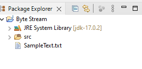

# Lab 1-1 Byte Stream IO
### IBM Intermediate Java

---

## Lab Overview

This is the first lab that explores the file stream interface in Java. Each lab in this series builds on the previous ones so at the ent of each lab, save your work so you can just add new code in each lab.

The primary activity in this lab is copying a file byte by byte using `FileInputStream` and `FileOutputStream`


## Part One: Setup

1. Create a Java Project with a package called iolab.

2. Copy the sample data `Sample.txt` file from the lab folder into the root of the project directory. Make sure that it is the rootthe project directory and _not_ the root of the `src` directory. If you put it into any other location, your code will not be able to find it and will throw an `IOException` when an attempt is made to open it. >Note: that the output file will not be visible in the project explorer since it is not added to the list of files tracked by the project manifest when it is created. To see your output file, you have to look at the project directory with the Windows file explore.

3. You can create your own file to use as sample input, but you should ensure that it is a `UTF-8` encoded file if you want to use it in the next lab.<br/><br/>

## Part Two: Java Code Structure

1. Create a class with a `main()` method. In the example that follows the class is named `ByteCopy`.

2. Add the `throws` notation to let Java know that `main()` class throws an `IOException`. This is not good practice – to have an unhandled `IOException`, but this little shortcut will make coding the lab simpler.

```java 
package iolab;

import java.io.IOException;

public class ByteCopy {

    public static void main(String[] args) {

        try {

        } catch (IOException e) {

            System.out.println(e.getMessage());
        } finally {
        }
    }
}
```

<br/><br/>

## Part Three: Add the input file operations

1. Good programming practice is to close every file that is opened. 

2. Add the open file code in the `try` block and the close file operation in the `finally` block – the reason for placing this in the `finally` block will be apparent soon.

3. Add the sample file, here named `SampleText.txt` into the main project directory. This file is a modification of the UTF-8 sample file provided by W3C org for testing purposes.

4. You can copy the file from wherever it is then paste it into the project directly in Eclipse. It should look like this. Note that the file is not in the “src” directory bit in the root project directory.<br/>

<br/>
5. Add the statements to open and close the input file as well as an output statement in the `catch` block that will advise us if the input file cannot be opened. If your code throws this exception at this point the lab, that means that you have put the input file in the wrong place. The throws clause on the main method is to avoid having to wrap the code that closes the file in another `try` block.
6. Add a temporary output statement at the end of the code to confirm the code executed.

```java 
import java.io.FileInputStream;
import java.io.IOException;

public class ByteCopy  {

    public static void main(String[] args) throws IOException {
        FileInputStream infile = null;
        try {
            infile = new FileInputStream("SampleText.txt");
        } catch (IOException e) {
            System.out.println(e.getMessage());
        } finally {
           if (infile != null) infile.close();
        }
        System.out.println("Yay!!");
    }
}
 ```

7. Run the code as a Java application to check that it works.
<br/><br/>

## Part Four: Add the code that reads and writes the bytes

1. Add an integer variable `byteCount` that will count the number of bytes copied.

2. Add a `byte` type variable to receive the single byte input. Notice we have to cast this to a `byte` since the `read()` method returns an `int`. Assigning an `int` to a byte sized variable is a narrowing conversion. The cast works correctly because the byte read is stored in the lowest byte of the `int`.

3. As an experiment, you can use an `int` instead of a `byte` and confirm that code still executes correctly.

```java 
import java.io.FileInputStream;
import java.io.FileOutputStream;
import java.io.IOException;

public class ByteCopy {
    
	public static void main(String[] args) throws IOException {
		FileInputStream infile = null;
		FileOutputStream outfile = null;
		byte b = 0;
		int byteCount = 0;
		
		try {
			infile = new FileInputStream("SampleText.txt");
			outfile = new FileOutputStream("Copy.txt");
			
			while ((b = (byte)infile.read()) != -1) {
				outfile.write(b);
				byteCount++;
			}
            
		} catch (IOException e) {
			System.out.println(e.getMessage());
		} finally {
			infile.close();
			outfile.close();
		}
        System.out.println(byteCount + " bytes copied");
	}
}
```
1. Run the code

2. Open the output file in the file explorer to ensure that the copy worked correctly. Note that the file is not visible in the eclipse project explorer because the file `Copy.txt` does not get added to the project when it is written, it's just..... there.

3. Don’t delete your project. You can modify it to do the next lab.<br/><br/>

---
## DONE!!


